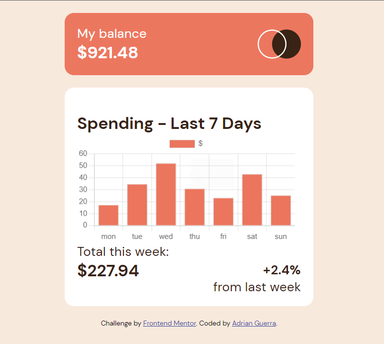

# Frontend Mentor - Expenses chart component solution

This is a solution to the [Expenses chart component challenge on Frontend Mentor](https://www.frontendmentor.io/challenges/expenses-chart-component-e7yJBUdjwt). Frontend Mentor challenges help you improve your coding skills by building realistic projects. 

## Table of contents

- [Overview](#overview)
  - [The challenge](#the-challenge)
  - [Screenshot](#screenshot)
  - [Links](#links)
- [My process](#my-process)
  - [Built with](#built-with)
  - [What I learned](#what-i-learned)
  - [Continued development](#continued-development)
  - [Useful resources](#useful-resources)
- [Author](#author)


## Overview

### The challenge

Users should be able to:

- View the bar chart and hover over the individual bars to see the correct amounts for each day
- See the current day’s bar highlighted in a different colour to the other bars
- View the optimal layout for the content depending on their device’s screen size
- See hover states for all interactive elements on the page
- **Bonus**: Use the JSON data file provided to dynamically size the bars on the chart

### Screenshot



### Links

- Solution URL: [Add solution URL here](https://your-solution-url.com)
- Live Site URL: [https://expenses-chart-component-two-pink.vercel.app/](https://expenses-chart-component-two-pink.vercel.app/)

## My process

### Built with

- Semantic HTML5 markup
- CSS custom properties
- Flexbox
- Mobile-first workflow
- [React](https://reactjs.org/) - JS library
- [Chart.js](https://www.chartjs.org/) - JS charting library


### What I learned


```html
<body>
  <div id="root"></div>
  <script type="module" src="/src/main.jsx"></script>
</body>
```

```jsx
function App() {
  const days = Data.map(data => data.day)
  const amounts = Data.map(data => data.amount)
  
  const data = {
    labels: days,
    datasets: [
        {
            label: '$',
            data: amounts,
            backgroundColor: ['#eb755d'],
            hoverBackgroundColor: ['#ff9b87'],
            borderWidth: 1,
        }
    ]
  };
}
```
The "map" function allowed me to return only the "days" and "amounts" from "Data" and store
them in respective variables, which I then used in setting up the chart.
I was able to pass down the chart data from the json file as a prop. 

### Continued development

Going forward, I'll be using React a lot more. I found props to be very convenient. Next, I 
plan to learn some of the other React hooks. 


### Useful resources

- [Chart.js](https://www.chartjs.org/) - This helped me implement a chart basesd on the json data.
- [React.dev](https://react.dev/) - Updated React docs that helped me gain an understanding of what React has to offer.


## Author

- LinkedIn - [Adrian Guerra](https://www.linkedin.com/in/adrian-guerra-a210a4196/)
- Frontend Mentor - [@adie9](https://www.frontendmentor.io/profile/adie9)

